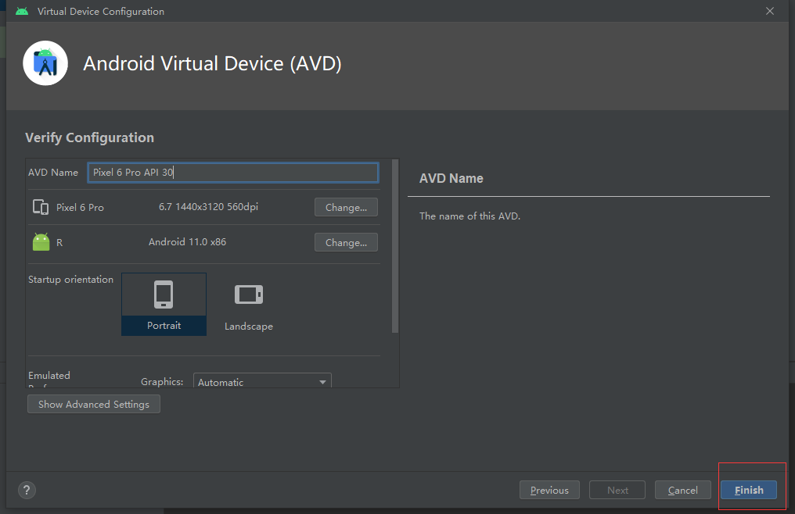
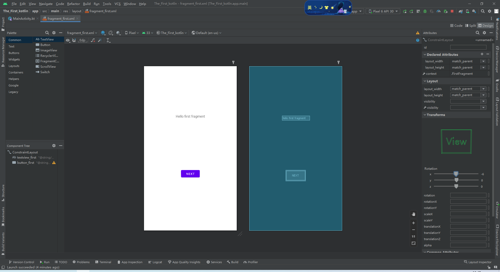
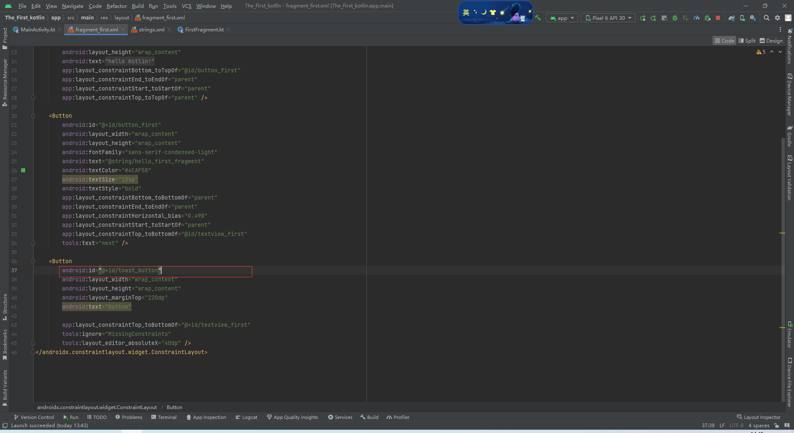
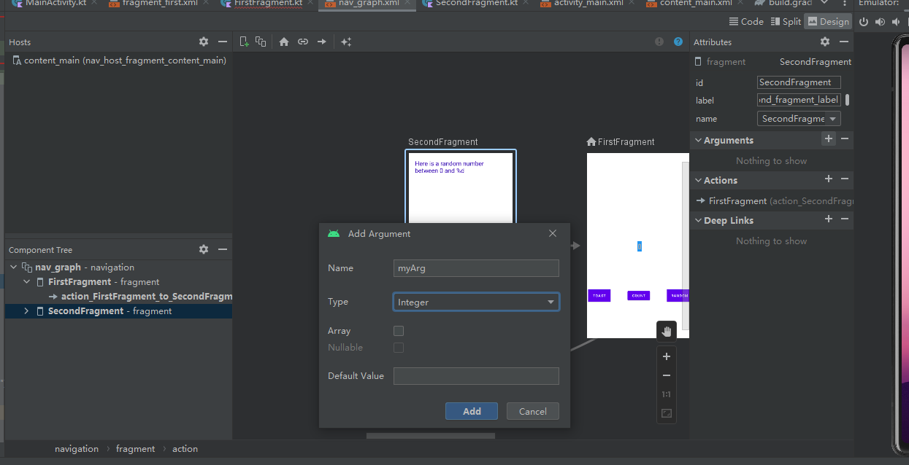

# The_First_Kotlin

## 创建basic Activity项目

选择创建一个Basic Activity，选择Kotlin语言，并命名应用程序


等待gradle依赖导入，构建成功！


## 创建虚拟设备


随便选择一个虚拟设备创建




## 运行效果图：


等待构建运行：


运行效果图：


## **探索界面布局编辑器**

每个界面由一个Fragment组成，初始界面显示的FirstFragment，双击fragment_first.xml可以查看具体的布局设计界面



在Basic Activity中，包含了基本的导航组件，Android app关联两个fragments，第一个屏幕显示了“Hello first fragment”由FirstFragment创建，界面元素的排列由布局文件指定，查看res>layout>fragment_first.xml，


查看布局的代码（Code），修改Textview的**Text**属性，

```kotlin
android:text="@string/hello_first_fragment"
```


右键该代码，选择**Go To > Declaration or Usages**，跳转到values/strings.xml，看到高亮文本


修改字符串属性值为“Hello Kotlin!”。更进一步，修改字体显示属性，在Design视图中选择**textview_first**文本组件，在Common Attributes属性下的textAppearance域，设置相关的文字显示属性，修改了如下红标地方的属性设置，查看布局的XML代码，可以看到新属性被应用。


### 向页面添加更多的布局

本步骤将向第一个Fragment添加更多的视图组件

#### 查看视图的布局约束

在**fragment_first.xml**，查看TextView组件的约束属性：


#### 添加按钮和约束

从Palette面板中拖动Button到first_fragment


调整Button的约束，设置Button的Top>BottonOf textView，

随后添加Button的左侧约束至屏幕的左侧，Button的底部约束至屏幕的底部。查看Attributes面板，修改将id从button修改为toast_button（注意修改id将重构代码）



#### 调整Next按钮

Next按钮是工程创建时默认的按钮，查看Next按钮的布局设计视图，它与TextView之间的连接不是锯齿状的而是波浪状的，表明两者之间存在链（chain），是一种两个组件之间的双向联系而不是单向联系。删除两者之间的链，可以在设计视图右键相应约束，选择Delete（注意两个组件要双向删除）；


或者在属性面板的Constraint Widget中移动光标到相应约束点击删除。


#### 添加新的约束

添加Next的右边和底部约束至父类屏幕（如果不存在的话），Next的Top约束至TextView的底部。最后，TextView的底部约束至屏幕的底部。效果看起来如下图所示：


#### 更改组件的文本

fragment_first.xml布局文件代码中，找到toast_button按钮的text属性部分

```kotlin
<Button
   android:id="@+id/toast_button"
   android:layout_width="wrap_content"
   android:layout_height="wrap_content"
   android:text="Button"

```

这里text的赋值是一种硬编码，点击文本，左侧出现灯泡状的提示，选择 **Extract string resource**。


弹出对话框，令资源名为toast_button_text，资源值为Toast，并点击OK。


于是，在资源文件string.xml定义了字符串，以上操作可以手动在string.xml文件中定义并引用。


#### 更新Next按钮

在属性面板中更改Next按钮的id，从button_first改为random_button。


在string.xml文件，右键**next**字符串资源，选择 **Refactor > Rename**，修改资源名称为**random_button_text**，点击**Refactor** 。随后，修改**Next**值为**Random**。


#### 添加第三个按钮

向fragment_first.xml文件中添加第三个按钮，位于Toast和Random按钮之间，TextView的下方。新Button的左右约束分别约束至Toast和Random，Top约束至TextView的底部，Buttom约束至屏幕的底部，看起来的效果：


修改后的fragment_first.xml的代码:

```xml
<?xml version="1.0" encoding="utf-8"?>
<androidx.constraintlayout.widget.ConstraintLayout xmlns:android="http://schemas.android.com/apk/res/android"
    xmlns:app="http://schemas.android.com/apk/res-auto"
    xmlns:tools="http://schemas.android.com/tools"
    android:layout_width="match_parent"
    android:layout_height="match_parent"
    tools:context=".FirstFragment">

    <TextView
        android:id="@+id/textview_first"
        android:layout_width="wrap_content"
        android:layout_height="wrap_content"
        android:fontFamily="sans-serif-condensed"
        android:text="@string/hello_first_fragment"
        android:textColor="@android:color/darker_gray"
        android:textSize="30sp"
        android:textStyle="bold"
        app:layout_constraintBottom_toBottomOf="parent"
        app:layout_constraintEnd_toEndOf="parent"
        app:layout_constraintStart_toStartOf="parent"
        app:layout_constraintTop_toTopOf="parent" />

    <Button
        android:id="@+id/random_button"
        android:layout_width="wrap_content"
        android:layout_height="wrap_content"
        android:text="@string/random_button_text"
        app:layout_constraintBottom_toBottomOf="parent"
        app:layout_constraintEnd_toEndOf="parent"
        app:layout_constraintTop_toBottomOf="@+id/textview_first" />

    <Button
        android:id="@+id/toast_button"
        android:layout_width="wrap_content"
        android:layout_height="wrap_content"
        android:text="@string/toast_button_text"
        app:layout_constraintBottom_toBottomOf="parent"
        app:layout_constraintStart_toStartOf="parent"
        app:layout_constraintTop_toBottomOf="@+id/textview_first" />

    <Button
        android:id="@+id/count_button"
        android:layout_width="wrap_content"
        android:layout_height="wrap_content"
        android:text="@string/count_button_text"
        app:layout_constraintBottom_toBottomOf="parent"
        app:layout_constraintEnd_toStartOf="@+id/random_button"
        app:layout_constraintStart_toEndOf="@+id/toast_button"
        app:layout_constraintTop_toBottomOf="@+id/textview_first" />
</androidx.constraintlayout.widget.ConstraintLayout>

```

#### 更新按钮和文本框的外观

values>colors.xml定义了一些应用程序可以使用的颜色，添加新颜色screenBackground 值为 #2196F3，这是蓝色阴影色；添加新颜色buttonBackground 值为 #BBDEFB

##### 添加新的颜色资源

```colors.xml
<color name="screenBackground">#2196F3</color>
<color name="buttonBackground">#BBDEFB</color>

```


##### 设置组件的外观

1. fragment_first.xml的属性面板中设置屏幕背景色为

   android:background="@color/screenBackground"

2. 设置每个按钮的背景色为**buttonBackground**

   android:background="@color/buttonBackground"

   

   #### 设置组件的位置

   Toast与屏幕的左边距设置为24dp，Random与屏幕的右边距设置为24dp，利用属性面板的Constraint Widget完成设置。
   
   
   
   #### 运行应用程序
   
   


## **向页面添加组件并完成交互代码**

### 设置代码自动补全

Android Studio中，依次点击File>New Projects Settings>Settings for New Projects…，查找Auto Import选项，在Java和Kotlin部分，勾选Add Unambiguous Imports on the fly。


### TOAST按钮添加一个toast消息

打开FirstFragment.kt文件，有三个方法：onCreateView，onViewCreated和onDestroyView，在onViewCreated方法中使用绑定机制设置按钮的响应事件（创建应用程序时自带的按钮）。


    override fun onViewCreated(view: View, savedInstanceState: Bundle?) {
        super.onViewCreated(view, savedInstanceState)
    
        binding.randomButton.setOnClickListener {
            findNavController().navigate(R.id.action_FirstFragment_to_SecondFragment)
        }
        view.findViewById<Button>(R.id.toast_button).setOnClickListener {
            // create a Toast with some text, to appear for a short time
            val myToast = Toast.makeText(context, "Hello Toast!", Toast.LENGTH_LONG)
            // show the Toast
            myToast.show()
        }
        view.findViewById<Button>(R.id.count_button).setOnClickListener {
            countMe(view)
        }
    }


### 使Count按钮更新屏幕的数字


在FirstFragment.kt文件，为count_buttion按钮添加事件：

```kotlin
view.findViewById<Button>(R.id.count_button).setOnClickListener {
   countMe(view)
}
```

countMe()为自定义方法，以View为参数，每次点击增加数字1，具体代码为：

```kotlin
private fun countMe(view: View) {
   // Get the text view
   val showCountTextView = view.findViewById<TextView>(R.id.textview_first)

   // Get the value of the text view.
   val countString = showCountTextView.text.toString()

   // Convert value to a number and increment it
   var count = countString.toInt()
   count++

   // Display the new value in the text view.
   showCountTextView.text = count.toString()
}

```


### 向界面添加TextView显示随机数

1. 打开fragment_second.xml的设计视图中，当前界面有两个组件，一个Button和一个TextView（textview_second）。

2. 去掉TextView和Button之间的约束

3. 拖动新的TextView至屏幕的中间位置，用来显示随机数

4. 设置新的TextView的id为**@+id/textview_random**

5. 设置新的TextView的左右约束至屏幕的左右侧，Top约束至textview_second的Bottom，Bottom约束至Button的Top

6. 设置TextView的字体颜色textColor属性为**@android:color/white**，textSize为72sp，textStyle为bold

7. 设置TextView的显示文字为“R”

8. 设置垂直偏移量layout_constraintVertical_bias为0.45

   ```kotlin
   <TextView
      android:id="@+id/textview_random"
      android:layout_width="wrap_content"
      android:layout_height="wrap_content"
      android:text="R"
      android:textColor="@android:color/white"
      android:textSize="72sp"
      android:textStyle="bold"
      app:layout_constraintBottom_toTopOf="@+id/button_second"
      app:layout_constraintEnd_toEndOf="parent"
      app:layout_constraintStart_toStartOf="parent"
      app:layout_constraintTop_toBottomOf="@+id/textview_second"
      app:layout_constraintVertical_bias="0.45" />
   
   ```

   ### 更新显示界面文本的TextView(textview_second)

1. 在fragment_second.xml文件中，选择textview_second文本框，查看text属性，可见
   android:text="@string/hello_second_fragment
   对应的strings.xml文本为Hello second fragment. Arg: %1$s

2. 更改该文本框id为textview_header

3. 设置layout_width为match_parent，layout_height为wrap_content。

4. 设置top，left和right的margin为24dp，左边距和右边距也就是start和end边距。

5. 若还存在与Button的约束，则删除。

6. 向colors.xml添加颜色colorPrimaryDark，并将TextView颜色设置为@color/colorPrimaryDark，字体大小为24sp。

   <color name="colorPrimaryDark">#3700B3</color>

7. strings.xml文件中，修改hello_second_fragment的值为"Here is a random number between 0 and %d."

8. 使用Refactor>Rename将hello_second_fragment 重构为random_heading
  


## 启用SafeArgs


[SafeArgs](https://developer.android.com/guide/navigation/navigation-pass-data) 是一个 gradle 插件，它可以帮助您在导航图中输入需要传递的数据信息，作用类似于Activity之间传递数据的Bundle。


project配置

```
plugins {
    id 'com.android.application' version '7.4.2' apply false
    id 'com.android.library' version '7.4.2' apply false
    id 'org.jetbrains.kotlin.android' version '1.8.0' apply false
    id 'androidx.navigation.safeargs.kotlin' version '2.5.3' apply false
}
```

module配置：


#### 刚开始遇到配置找不到源的问题，后面换成热点解决

### 创建导航动作的参数


1. 打开导航视图，点击`FirstFragment`，查看其属性。
2. 在`Actions`栏中可以看到导航至`SecondFragment`
3. 同理，查看`SecondFragment`的属性栏
4. 点击Arguments **+**符号
5. 弹出的对话框中，添加参数myArg，类型为整型Integer




### FirstFragment添加代码，向SecondFragment发数据

1. 打开FirstFragment.kt源代码文件

2. 找到onViewCreated()方法，该方法在onCreateView方法之后被调用，可以实现组件的初始化。找到Random按钮的响应代码，注释掉原先的事件处理代码

   

3. 实例化TextView，获取TextView中文本并转换为整数值

   ```kotlin
           binding.randomButton.setOnClickListener {
               //findNavController().navigate(R.id.action_FirstFragment_to_SecondFragment)
               val showCountTextView = view.findViewById<TextView>(R.id.textview_first)
               val currentCount = showCountTextView.text.toString().toInt()
               val action = FirstFragmentDirections.actionFirstFragmentToSecondFragment(currentCount)
   
               findNavController().navigate(action)
           }
   ```

   

    

4. 将`currentCount`作为参数传递给actionFirstFragmentToSecondFragment()

   ```kotlin
   val action = FirstFragmentDirections.actionFirstFragmentToSecondFragment(currentCount)
   
   ```

   

5. 添加导航事件代码

```kotlin
findNavController().navigate(action)

```


完整代码：

```kotlin
    override fun onViewCreated(view: View, savedInstanceState: Bundle?) {
        super.onViewCreated(view, savedInstanceState)

//        binding.randomButton.setOnClickListener {
//            findNavController().navigate(R.id.action_FirstFragment_to_SecondFragment)
//        }
        binding.randomButton.setOnClickListener {
            //findNavController().navigate(R.id.action_FirstFragment_to_SecondFragment)
            val showCountTextView = view.findViewById<TextView>(R.id.textview_first)
            val currentCount = showCountTextView.text.toString().toInt()
            val action = FirstFragmentDirections.actionFirstFragmentToSecondFragment(currentCount)

            findNavController().navigate(action)
        }
        view.findViewById<Button>(R.id.toast_button).setOnClickListener {
            // create a Toast with some text, to appear for a short time
            val myToast = Toast.makeText(context, "Hello Toast!", Toast.LENGTH_LONG)
            // show the Toast
            myToast.show()
        }
        view.findViewById<Button>(R.id.count_button).setOnClickListener {
            countMe(view)
        }

    }
```

现在能够将count成功传到secondFragment当中，接下来实现随机数代码


### 添加SecondFragment的代码

1. 导入navArgs包

   ```kotlin
   import androidx.navigation.fragment.navArgs
   
   ```

   

2. `onViewCreated()`代码之前添加一行

   ```kotlin
   val args: SecondFragmentArgs by navArgs()
   ```

   

3. `onViewCreated()`中获取传递过来的参数列表，提取count数值，并在textview_header中显示

   ```kotlin
   val count = args.myArg
   val countText = getString(R.string.random_heading, count)
   view.findViewById<TextView>(R.id.textview_header).text = countText
   
   ```

   

4. 根据count值生成随机数

   ```kotlin
   val random = java.util.Random()
   var randomNumber = 0
   if (count > 0) {
      randomNumber = random.nextInt(count + 1)
   }
   
   ```

   

5. textview_random中显示count值

   ```kotlin
   view.findViewById<TextView>(R.id.textview_random).text = randomNumber.toString()
   
   ```

   

   实现结果：

   

   